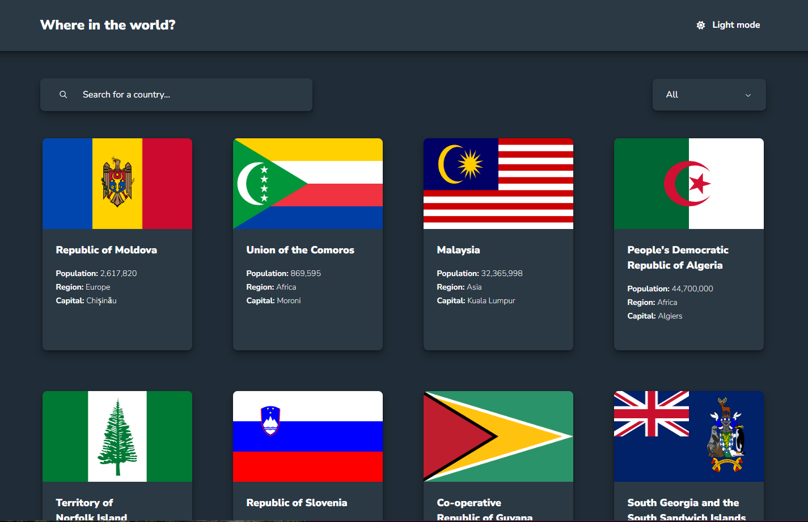

# Frontend Mentor - REST Countries API with color theme switcher solution

This is a solution to the [REST Countries API with color theme switcher challenge on Frontend Mentor](https://www.frontendmentor.io/challenges/rest-countries-api-with-color-theme-switcher-5cacc469fec04111f7b848ca). Frontend Mentor challenges help you improve your coding skills by building realistic projects. 

## Table of contents

- [Overview](#overview)
  - [The challenge](#the-challenge)
  - [Screenshot](#screenshot)
  - [Links](#links)
- [My process](#my-process)
  - [Built with](#built-with)
  - [What I learned](#what-i-learned)
  - [Useful resources](#useful-resources)
- [Author](#author)


## Overview

### The challenge

Users should be able to:

- See all countries from the API on the homepage
- Search for a country using an `input` field
- Filter countries by region
- Click on a country to see more detailed information on a separate page
- Click through to the border countries on the detail page
- Toggle the color scheme between light and dark mode *(optional)*

### Screenshot




### Links

- Solution URL: [https://github.com/AcharaChisomSolomon/REST-countries-API](https://github.com/AcharaChisomSolomon/REST-countries-API)
- Live Site URL: [https://magnificent-duckanoo-35b4c3.netlify.app/](https://magnificent-duckanoo-35b4c3.netlify.app/)

## My process

### Built with

- Semantic HTML5 markup
- CSS custom properties
- Flexbox
- CSS Grid
- Mobile-first workflow
- [React](https://reactjs.org/) - JS library
- [Emotion](https://emotion.sh/docs/introduction) - For styles

### What I learned

Proud of my custom react hook with for fetching data with inbuilt caching

```js
import React from 'react';

// Simple in-memory cache
const cache = new Map();

export function useFetch(url) {
  const [data, setData] = React.useState(null);
  const [loading, setLoading] = React.useState(true);
  const [error, setError] = React.useState(null);

  React.useEffect(() => {
    console.log('running')
    let ignore = false;
    setLoading(true);
    setError(null);

    // Check cache first
    if (cache.has(url)) {
      console.log('Using cached data for:', url);
      setData(cache.get(url));
      setLoading(false);
      return;
    }

    const handleFetch = async () => {
      try {
        const response = await fetch(url);

        if (!response.ok) {
          throw new Error(`HTTP error! status: ${response.status}`);
        }

        if (ignore) {
          return;
        }

        const responseData = await response.json();
        
        // Cache the response
        cache.set(url, responseData);
        console.log('Cached data for:', url);
        
        setData(responseData);
        setError(null);
        setLoading(false);
      } catch (e) {
        if (!ignore) {
          setError(e.message);
          setLoading(false);
        }
      }
    };

    handleFetch();

    return () => {
      ignore = true;
    };
  }, [url]);

  return { data, loading, error };
}
```


### Useful resources

- [UI DEV](https://ui.dev/c/react) - This helped me become really comfortable with react.
- [CSS FOR JS](https://courses.joshwcomeau.com/css-for-js) - This deepened my mental model of CSS.